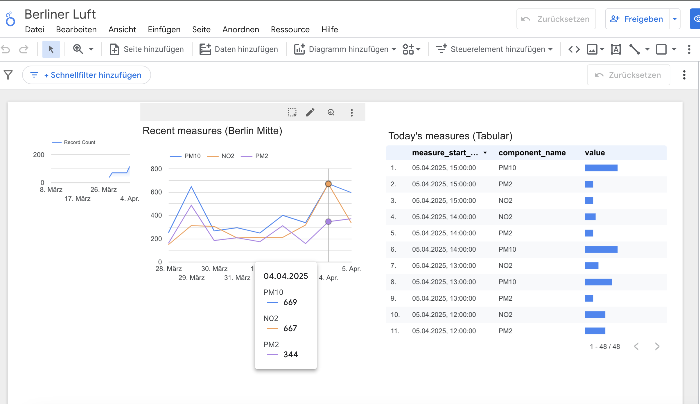
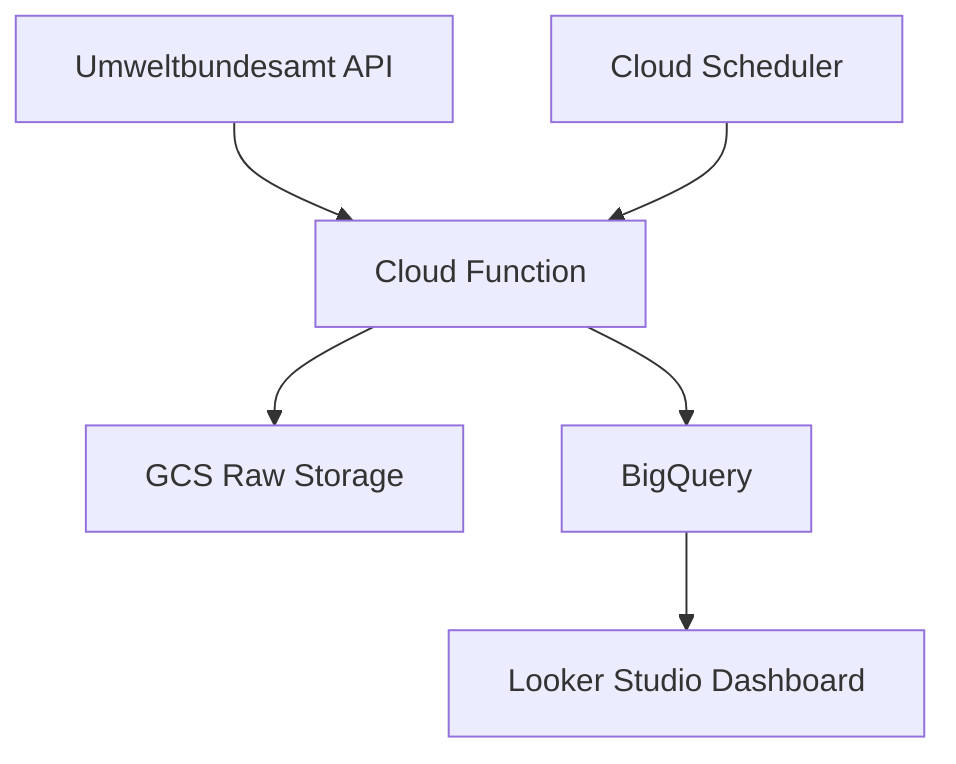
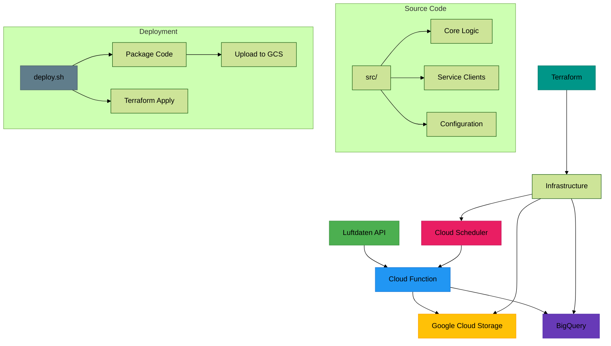

# Berlin Air Quality Monitor

Daily updated air quality data pipeline for Berlin, ingesting data from Umweltbundesamt API into Google Cloud Storage.



## Architecture



## Features

- Hourly data collection
- Automated pipeline with Terraform
- Error-retry mechanisms
- Hive-style partitioned storage
- Using v3 of the Umweltbundesamt air data quality API: https://www.umweltbundesamt.de/daten/luft/luftdaten/

## Prerequisites

Python 3.9+

Google Cloud account

Terraform 1.4+

## Setup

1. Clone Repository

```bash
Copy
git clone https://github.com/yourusername/berlin-air-quality.git
cd berlin-air-quality
```

2. Install Dependencies

```bash
Copy
pip install -r requirements.txt
```

3. GCP Authentication

```bash
Copy
gcloud auth application-default login
```

4. Terraform Setup

```
bash
Copy
cd terraform
terraform init
terraform apply -var="project_id=YOUR_PROJECT_ID"
```

## Automated deployment script

in the project root, run `bash deploy.sh`

This will:

- zip files in src and upload them to gcp
- use terraform to deploy

The script assumes:

- Your Terraform state is properly initialized
- You have write access to the GCS bucket
- The service account has required permissions

## Directory Structure

```
.
├── README.md               # Project documentation
├── deploy.sh               # Full deployment script (infra + code)
├── function.zip            # Auto-generated function package
├── legacy/                 # Deprecated scripts and code
│   ├── ...                # Legacy implementation details
├── requirements.txt        # Python dependencies
├── src/                    # Main application source
│   ├── config/            # Configuration settings
│   │   ├── constants.py   # Environment constants
│   │   └── schemas.py     # BigQuery table schemas
│   ├── core/              # Business logic components
│   │   ├── data_transformer.py  # Data transformation logic
│   │   ├── dimension_manager.py # Dimension table handling
│   │   └── measures_processor.py # Measures pipeline
│   ├── services/          # Cloud service clients
│   │   ├── api_client.py  # Luftdaten API client
│   │   ├── bigquery_client.py # BigQuery operations
│   │   └── gcs_uploader.py # GCS upload handler
│   ├── utils/             # Utility functions
│   │   └── time_utils.py  # Timestamp handling
│   └── main.py            # Cloud Function entry point
├── terraform/             # Infrastructure as Code
│   ├── main.tf            # Primary infrastructure config
│   ├── variables.tf       # Terraform variables
│   └── outputs.tf         # Output references
├── test.sh                # Local test runner
└── worksteps.md           # Development process documentation
```




## Configuration

Set environment variables in .env:

```ini
GCS_BUCKET_NAME="berliner-luft"
GCP_PROJECT_ID="your-project-id"
```

## to test the pipeline locally (run the cloud scripts from main.py locally)

run
`functions-framework --target=main`

`curl -X POST http://localhost:8080`
