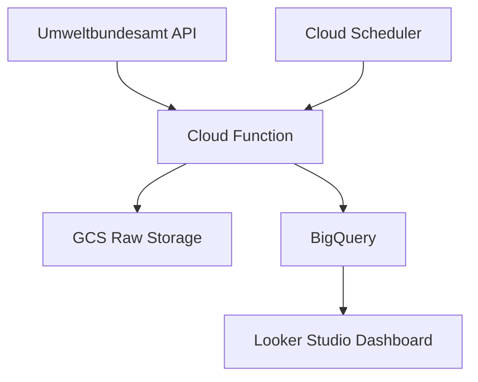

# Berlin Air Quality Monitor

Real-time air quality data pipeline for Berlin, ingesting data from Umweltbundesamt API into Google Cloud Storage.

## Architecture



## Features
- Hourly data collection

- Automated pipeline with Terraform

- Error-retry mechanisms

- Hive-style partitioned storage

- Using v3 of the Umweltbundesamt air data quality API: https://www.umweltbundesamt.de/daten/luft/luftdaten/


## Prerequisites
Python 3.9+

Google Cloud account

Terraform 1.4+


## Setup
1. Clone Repository
```bash
Copy
git clone https://github.com/yourusername/berlin-air-quality.git
cd berlin-air-quality
```

2. Install Dependencies
```bash
Copy
pip install -r requirements.txt
```

3. GCP Authentication
```bash
Copy
gcloud auth application-default login
```

4. Terraform Setup
```
bash
Copy
cd terraform
terraform init
terraform apply -var="project_id=YOUR_PROJECT_ID"
```

## Directory Structure

```
├── terraform/           # Infrastructure definitions
│   ├── main.tf
│   ├── variables.tf
├── src/
│   ├── pipeline.py      # Data ingestion script
│   ├── api_client.py    # API wrapper
│   └── gcs_uploader.py  # GCS upload utilities
├── requirements.txt
└── README.md
```


## Configuration

Set environment variables in .env:

```ini
GCS_BUCKET_NAME="berliner-luft"
GCP_PROJECT_ID="your-project-id"
```

## to test locally
run 
`functions-framework --target=main`

`curl -X POST http://localhost:8080`

## Future Enhancements
- Add BigQuery integration

- Implement Airflow orchestration

- Create monitoring dashboards