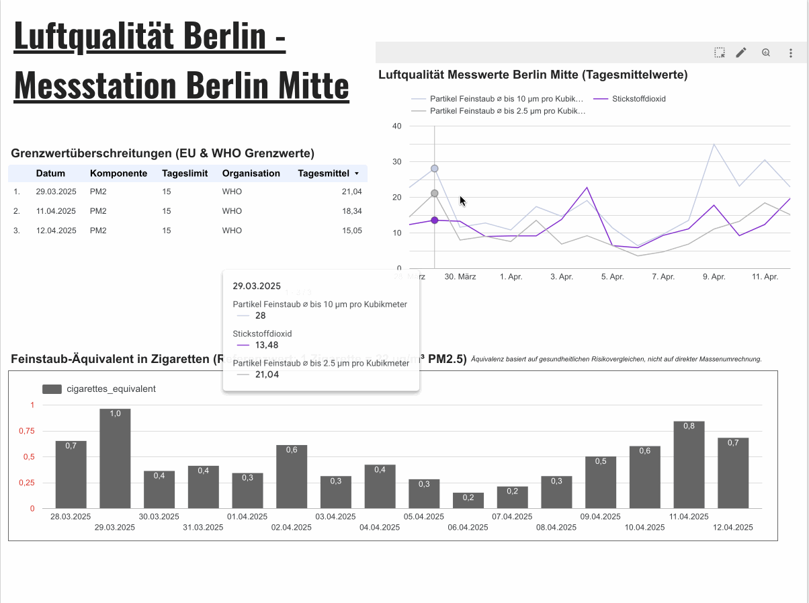
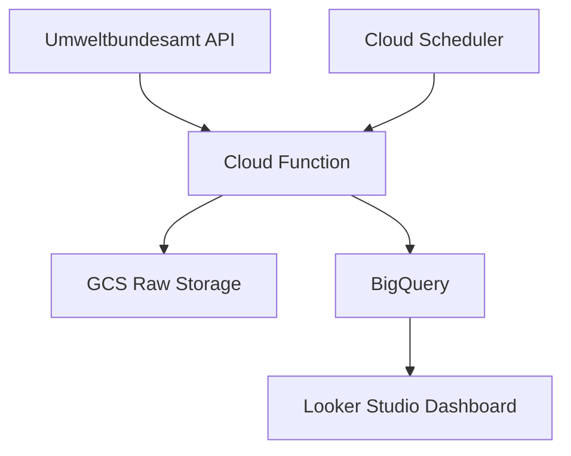

# Berlin Air Quality Monitor

*Daily updated air quality data pipeline for Berlin Mitte, ingesting data from Umweltbundesamt API into Google Cloud Storage.*

*Final project by Alexander Heinz for [Data Engineering Zoomcamp 2025](https://github.com/DataTalksClub/data-engineering-zoomcamp)*

### [Click here to go to the live dashboard](https://lookerstudio.google.com/reporting/dd051443-68b7-4ff7-84bb-29031462c339/page/ELwFF)



*Fig. 1: Preview of the dashboard (2025-04-13)*

## Problem Statement

Air quality has become a critical public health concern in Germany, with increasing awareness of pollution impacts following recent PM2.5 limit exceedances and WHO warnings about urban air quality.
While the [Umweltbundesamt portal](https://www.umweltbundesamt.de/daten/luft/luftdaten/luftqualitaet/) provides hourly measurements and displays them in a graphical way, it lacks:

- Personalized insights: No option to focus on specific locations (like Berlin-Mitte near my residence)
- Actionable metrics: Missing intuitive comparisons (e.g., "equivalent to X cigarettes smoked")
- Limit tracking: No persistent count of Grenzwertüberschreitungen (EU limit exceedances)
- Personalization: With programming skills and this project, measurements of personal interest can be displayed in a personal dashboard

This project addresses these gaps by creating an automated pipeline that:

- Focuses on hyperlocal data (single monitoring station)
- Translates technical µg/m³ values to relatable equivalents
- Tracks daily limit violations through persistent storage
- Uses cloud infrastructure for potential nationwide scaling

By combining regulatory data with contextual interpretation, I empower citizens to make informed decisions about outdoor activities during pollution peaks.

## Architecture



*Fig. 2: Project Logic*

## Features

- Automated pipeline with Terraform
- Google Cloud Bucket data storage
- Google BigQuery database
- Hive-style partitioned storage
- Google Looker Studio Dashboard
- Daily data updates (can be set to hourly using cron jobs)
- Using v3 of the Umweltbundesamt air data quality API: https://www.umweltbundesamt.de/daten/luft/luftdaten/

## Prerequisites

Python 3.9+

Google Cloud account & Cloud SDK

## Setup

1. Clone Repository

```bash
Copy
git clone https://github.com/yourusername/berlin-air-quality.git
cd berlin-air-quality
```

2. Install Dependencies

```bash
Copy
pip install -r requirements.txt
```

3. GCP Authentication

```bash
Copy
gcloud auth application-default login
```

4. Terraform Setup

```
bash
Copy
cd terraform
terraform init
terraform apply -var="project_id=YOUR_PROJECT_ID"
```

## Automated deployment script

in the project root, run `bash deploy.sh`

This will:

- zip files in src and upload them to gcp
- use terraform to deploy

The script assumes:

- Your Terraform state is properly initialized
- You have write access to the GCS bucket
- The service account has required permissions

## Directory Structure

```
.
├── README.md               # Project documentation
├── deploy.sh               # Full deployment script (infra + code)
├── function.zip            # Auto-generated function package
├── legacy/                 # Deprecated scripts and code
│   ├── ...                # Legacy implementation details
├── requirements.txt        # Python dependencies
├── src/                    # Main application source
│   ├── config/            # Configuration settings
│   │   ├── constants.py   # Environment constants
│   │   └── schemas.py     # BigQuery table schemas
│   ├── core/              # Business logic components
│   │   ├── data_transformer.py  # Data transformation logic
│   │   ├── dimension_manager.py # Dimension table handling
│   │   └── measures_processor.py # Measures pipeline
│   ├── services/          # Cloud service clients
│   │   ├── api_client.py  # Luftdaten API client
│   │   ├── bigquery_client.py # BigQuery operations
│   │   └── gcs_uploader.py # GCS upload handler
│   ├── utils/             # Utility functions
│   │   └── time_utils.py  # Timestamp handling
│   └── main.py            # Cloud Function entry point
├── terraform/             # Infrastructure as Code
│   ├── main.tf            # Primary infrastructure config
│   ├── variables.tf       # Terraform variables
│   └── outputs.tf         # Output references
├── test.sh                # Local test runner
└── worksteps.md           # Development process documentation
```

## Configuration

Set your own environment variables in .env for local testing:

```ini
GCS_BUCKET_NAME="berliner-luft"
GCP_PROJECT_ID="your-project-id"
```

## to test the pipeline locally (run the cloud scripts from main.py locally)

run
`functions-framework --target=main`

`curl -X POST http://localhost:8080`

## FAQ

### Help! Why is everything in German?

- Es tut mir sehr Leid ;P

### Why Partitioning & Clustering?

- Time Partitioning: By partitioning on `measure_start_time`, we're optimizing queries that filter by date ranges. This reduces the amount of data scanned, which is especially useful when dealing with a large volume of time-series air quality measurements. It leads to faster query performance and lower cost because BigQuery only processes the relevant partitions.
- Clustering: Clustering on `component_id` and `station_id` helps organize the data physically on disk. Since queries frequently filter or aggregate by these columns—perhaps to analyze measurements by specific air quality components or stations—the clustering allows BigQuery to more efficiently locate and process only the pertinent rows. This further reduces scan times and improves query performance.

### What are ETL steps in order to display the data? The API doesn't provide all information in 1 single table!

For the plots on the dashboard, BigQuery Views were created, combining different tables from the API into comprehensive tables:

```sql
SELECT 
  m.station_id,
  m.measure_start_time,
  m.measure_end_time,
  c.code AS component_code,
  c.name AS component_name,
  c.unit,
  s.name AS scope_name,
  s.description AS scope_description,
  m.value,
  m.index
FROM airquality.raw_measures m
JOIN airquality.dim_components c
  ON m.component_id = c.id
LEFT JOIN airquality.dim_scopes s  -- Use LEFT JOIN in case scope info is missing
  ON m.scope_id = s.scope_id
```

### Where did you get the data for the limits & cigarette equivalents?

For the limits by WHO & EU, an additional table was created using a SQL query in the bigquery database, relying on external information by [EU](https://www.tagesschau.de/wissen/klima/luftverschmutzung-grenzwerte-100.html) and [WHO](https://www.umweltbundesamt.de/themen/stellungnahme-who-luftqualitaetsleitlinien-2021):

```sql
CREATE OR REPLACE TABLE `airquality.air_quality_limits` (
  pollutant STRING,
  limit_type STRING,
  value_ug_m3 FLOAT64,
  organization STRING,
  category STRING
);

INSERT INTO `airquality.air_quality_limits` VALUES
('PM10', '24h_mean', 45, 'WHO', 'Grenzwert'),
('PM10', 'annual', 15, 'WHO', 'Grenzwert'),
('PM2.5', '24h_mean', 15, 'WHO', 'Grenzwert'),
('PM2.5', 'annual', 5, 'WHO', 'Grenzwert'),
('NO2', '1h_mean', 200, 'WHO', 'Grenzwert'),
('NO2', 'annual', 10, 'WHO', 'Grenzwert'),
('PM10', '24h_mean', 50, 'EU', 'Grenzwert'),
('PM2.5', 'annual', 25, 'EU', 'Grenzwert'),
('NO2', '1h_mean', 200, 'EU', 'Grenzwert'),
('NO2', 'annual', 40, 'EU', 'Grenzwert');
```

For the cigarettes equivalent, the [commonly used formula](https://berkeleyearth.org/air-pollution-and-cigarette-equivalence/) (22 mikrograms / 24h = 1 cigarette) was used and implemented in a query:

```sql
WITH hourly_data AS (
  SELECT
    rm.station_id,
    TIMESTAMP_TRUNC(rm.measure_start_time, DAY) AS measurement_day,
    dc.code AS component_code,
    rm.value AS pm_concentration,
    TIMESTAMP_TRUNC(rm.measure_start_time, HOUR) AS measurement_hour
  FROM
    `berliner-luft-dez.airquality.raw_measures` rm
  JOIN
    `berliner-luft-dez.airquality.dim_components` dc
    ON rm.component_id = dc.id
  WHERE
    rm.scope_id = 2
    AND dc.code IN ('PM2')
    AND rm.value IS NOT NULL
  QUALIFY ROW_NUMBER() OVER (
    PARTITION BY station_id, measurement_hour, component_code 
    ORDER BY measure_start_time DESC
  ) = 1
)

SELECT
  station_id,
  measurement_day,
  component_code,
  ROUND(AVG(pm_concentration), 1) AS daily_avg_pm,
  COUNT(*) AS measure_count,
  CASE
    WHEN component_code = 'PM2' THEN 
      ROUND(AVG(pm_concentration) / 22, 2)
    ELSE NULL
  END AS cigarettes_equivalent,
  CASE
    WHEN component_code = 'PM2' THEN
      CASE
        WHEN AVG(pm_concentration) >= 22 THEN '1+ Zigarettenäquivalent'
        ELSE FORMAT('%.1f Zigaretten', AVG(pm_concentration) / 22)
      END
    ELSE 'nicht zutreffend'
  END AS cigarette_text,
  CASE
    WHEN COUNT(*) = 24 THEN 'vollständig'
    ELSE 'unvollständig'
  END AS data_quality
FROM hourly_data
GROUP BY
  station_id,
  measurement_day,
  component_code
```

### Why terraform?

This project leverages Terraform to provision and manage its cloud infrastructure. Using Terraform, the following resources are automatically deployed and maintained:

- Cloud Functions: The air quality ingestion code is deployed as a Cloud Function, which ensures scalability by auto-scaling based on demand.
- Google Cloud Storage (GCS): Raw data is stored in a dedicated GCS bucket that provides high durability and low-cost storage.
- BigQuery: Processed data is stored in BigQuery for fast querying and analysis. BigQuery is also optimized through partitioning and clustering.
- Cloud Scheduler: This resource orchestrates the triggering of the Cloud Function on a defined schedule.

Utilizing Terraform allows us to manage these components as code, ensuring consistency across environments and making it easy to replicate or update the infrastructure. Moreover, this IaC approach aids in cost management by allowing for fine-tuning of resource allocation and scaling settings as the project's traffic evolves.

# License

The source code provided in this repository is for personal use and for educational purposes only. You are expressly prohibited from using, reproducing, or distributing any part of the code for any commercial purposes, nor may you modify or create derivative works based on the code without explicit written permission from the author.

All rights reserved by Alexander Heinz. Any unauthorized commercial use, distribution, or public display of the code or any derivative works is strictly forbidden.
